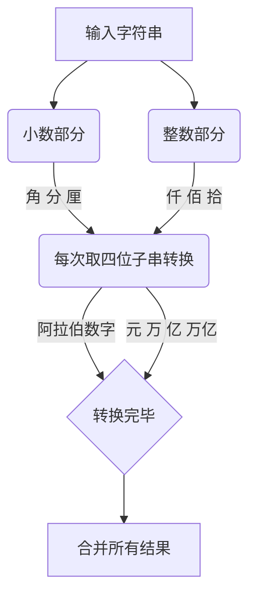

#### 将数字转化为中文字符串
数字  {"零","壹","贰","叁","肆","伍","陆","柒","捌","玖"}

单位  {"元","拾","佰","仟","万","亿"}

四位单位 {"元","万","亿","万亿"}

**输入**：
>1008

**输出**：
>壹仟零捌元

**思路**
整体思路是：
首先把数字分成整数部分和小数部分，采用4位一组进行转换。

其中实现的特性有：
* 中间多个0需合并为1个
* 后边多个0不读
* 0没有单位
* 

