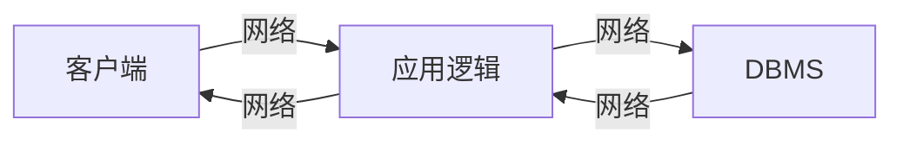

# Internet
**参考**: 数据库管理系统：原理与设计(第三版) [美] Raghu Ramakrishnan Johannes Gehrke

# 两个问题


1. 如何标识Internet上的站点
2. 一个站点上程序如何与另一个站点程序通信


&ensp;&ensp;&ensp;Internet通过统一资源表示符URI标识资源。例如 
>http://www.bookstore.com/index.html
* 访问资源的协议  http
* 资源所在主机 www.bookstore.com
* 主机中路径   ./index.html

## 超文本传输协议HTTP

HTTP是一种通信协议，定义双方之间的消息结构，使得双方理解对方消息。（客户-服务器协议）
### HTTP请求
&ensp;&ensp;&ensp;一个简单的HTTP请求

>GET index.html HTTP/1.1<br/> 
User-agent: Mozilla/4.0<br/>
Accept: text/html, image/gif, image/jepg<br/>

&ensp;&ensp;&ensp;第一行为请求行，包含HTTP方法域（GET和POST），URI域和HTTP版本域。

&ensp;&ensp;&ensp;第二行为用户代理(例如Netscape和Internet Explorer)

&ensp;&ensp;&ensp;第三行表示用户接受文件的格式。

### HTTP响应
&ensp;&ensp;&ensp;一个示例如下，

>HTTP/1.1 200 OK<br/>
Date: Mon, 04 Mar 2020 12:00:00 GMT<br/>
Content-Length: 1024<br/>
Content-Type: text/html<br/>
Last-Modified: Mon,22 Jun 1998 09:23:24 GMT<br/>
...内容

&ensp;&ensp;&ensp;响应包含状态行、若干消息标题行以及消息体。<br/>
&ensp;&ensp;&ensp;常见的状态码 <br/>
1xx 服务器收到请求，需要请求者继续执行操作<br/>
2xx  ok，请求成功，200，请求成功<br/>
3xx 重定向<br/>
4xx 客户端请求错误，403 forbidden请求资源被拒绝，404 not found找不到请求资源<br/>
5xx 服务器错误，500 服务器故障<br/>

### HTTP的特点
&ensp;&ensp;&ensp;HTTP是一个无状态协议。每一条消息，无论是从客户端到服务器或者反之，都是自包含的，一个请求建立的连接只维持到响应消息被发送。

# 三层结构




```sequence
客户端->应用逻辑: 我帅吗?（请求）
应用逻辑->DBMS: starhou帅吗?（请求）
DBMS-->应用逻辑: starhou帅爆了(响应)
应用逻辑->客户端: 你帅爆了(响应)
```

&ensp;&ensp;&ensp;上图所示的三层结构是通用的Internet应用体系架构。其优点有，

* 异构的系统。应用可以在不同层上利用不同平台和不同软件组件的长处，简单地在任一层修改或替换代码，而对其他层没有影响。<br/>
* 瘦客户端。客户端只需要为展示层提供足够的计算能力就可以。客户端一般为Web浏览器<br/>
* 集成的数据访问：有些应用需从多个数据源获取，这可以在中间层被透明的处理。中间层集中管理与所有数据库的连接。
* 对多用户的可扩展性，每一个客户端都是轻量级的，对系统的所有访问都通过中间层。
* 软件开发的好处：将应用清晰地划分为展示、数据访问和业务逻辑三部分。业务逻辑集中，易于维护。层层之间通过API来进行，应用的每一层都可以建立在可重用的构件上，这些构件可以独立地开发、排错和测试。
### 展示层
&ensp;&ensp;&ensp;展示层也就是客户端技术。HTML表单是客户端和中间层进行数据通信的一种普遍方法。

> </FROM ACTION> = "page.jsp" METHOD="GET" NAME = "LoginForm">
...
</FROM/>


