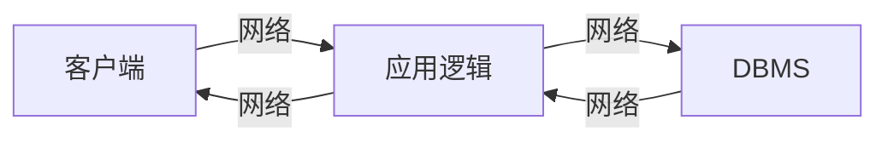
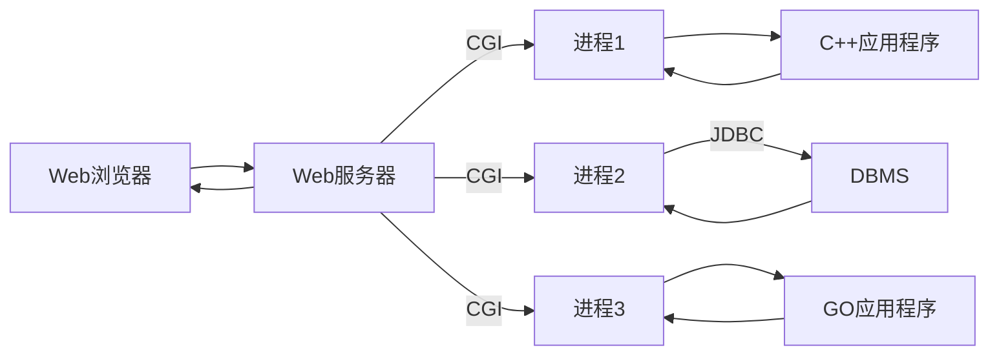
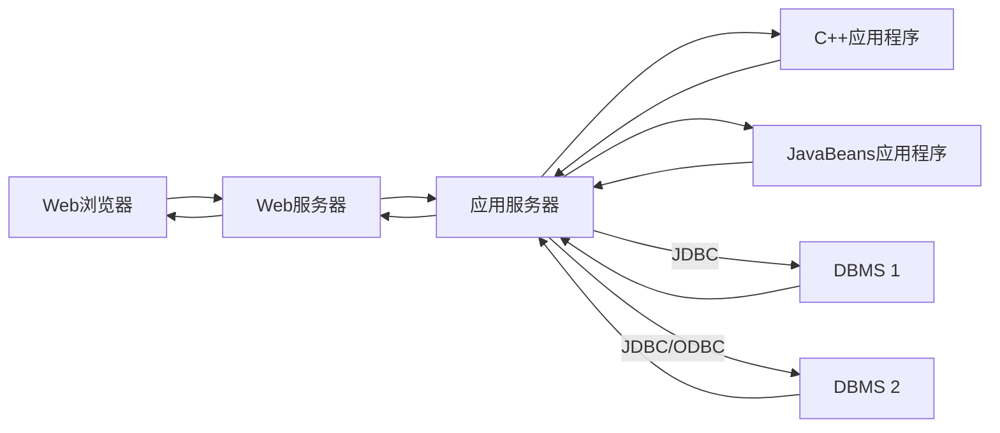

# Internet
**参考**: 数据库管理系统：原理与设计(第三版) [美] Raghu Ramakrishnan Johannes Gehrke

# 两个问题


1. 如何标识Internet上的站点
2. 一个站点上程序如何与另一个站点程序通信


&ensp;&ensp;&ensp;Internet通过统一资源表示符URI标识资源。例如 
>http://www.bookstore.com/index.html
* 访问资源的协议  http
* 资源所在主机 www.bookstore.com
* 主机中路径   ./index.html

## 超文本传输协议HTTP

HTTP是一种通信协议，定义双方之间的消息结构，使得双方理解对方消息。（客户-服务器协议）
### HTTP请求
&ensp;&ensp;&ensp;一个简单的HTTP请求

>GET index.html HTTP/1.1<br/> 
User-agent: Mozilla/4.0<br/>
Accept: text/html, image/gif, image/jepg<br/>

&ensp;&ensp;&ensp;第一行为请求行，包含HTTP方法域（GET和POST），URI域和HTTP版本域。

&ensp;&ensp;&ensp;第二行为用户代理(例如Netscape和Internet Explorer)

&ensp;&ensp;&ensp;第三行表示用户接受文件的格式。

### HTTP响应
&ensp;&ensp;&ensp;一个示例如下，

>HTTP/1.1 200 OK<br/>
Date: Mon, 04 Mar 2020 12:00:00 GMT<br/>
Content-Length: 1024<br/>
Content-Type: text/html<br/>
Last-Modified: Mon,22 Jun 1998 09:23:24 GMT<br/>
...内容

&ensp;&ensp;&ensp;响应包含状态行、若干消息标题行以及消息体。<br/>
&ensp;&ensp;&ensp;常见的状态码 <br/>
1xx 服务器收到请求，需要请求者继续执行操作<br/>
2xx  ok，请求成功，200，请求成功<br/>
3xx 重定向<br/>
4xx 客户端请求错误，403 forbidden请求资源被拒绝，404 not found找不到请求资源<br/>
5xx 服务器错误，500 服务器故障<br/>

### HTTP的特点
&ensp;&ensp;&ensp;HTTP是一个无状态协议。每一条消息，无论是从客户端到服务器或者反之，都是自包含的，一个请求建立的连接只维持到响应消息被发送。

# 三层结构




```sequence
客户端->应用逻辑: 我帅吗?（请求）
应用逻辑->DBMS: starhou帅吗?（请求）
DBMS-->应用逻辑: starhou帅爆了(响应)
应用逻辑->客户端: 你帅爆了(响应)
```

&ensp;&ensp;&ensp;上图所示的三层结构是通用的Internet应用体系架构。其优点有，

* 异构的系统。应用可以在不同层上利用不同平台和不同软件组件的长处，简单地在任一层修改或替换代码，而对其他层没有影响。<br/>
* 瘦客户端。客户端只需要为展示层提供足够的计算能力就可以。客户端一般为Web浏览器<br/>
* 集成的数据访问：有些应用需从多个数据源获取，这可以在中间层被透明的处理。中间层集中管理与所有数据库的连接。
* 对多用户的可扩展性，每一个客户端都是轻量级的，对系统的所有访问都通过中间层。
* 软件开发的好处：将应用清晰地划分为展示、数据访问和业务逻辑三部分。业务逻辑集中，易于维护。层层之间通过API来进行，应用的每一层都可以建立在可重用的构件上，这些构件可以独立地开发、排错和测试。
### 展示层
&ensp;&ensp;&ensp;展示层也就是客户端技术。
#### HTML表单
&ensp;&ensp;&ensp;HTML表单是客户端和中间层进行数据通信的一种普遍方法。表单的通用格式如下：

> <"FROM" ACTION> = "page.jsp" METHOD="GET" NAME = "LoginForm">
...
"\<FROM/>"

&ensp;&ensp;&ensp;一个HTML文档中可以包含多个表单，除了"\<FROM/>"标签，可以使用任何标签。

"\<FROM/>"标签有三个重要属性：
* **ACTION**:指定表单内容被提交的页面的URI；如果没有，怎默认使用当前URI。
* **METHOD**:用于将填好的表单中将用户输入提交到Web服务器的HTTP/1.0方法。GET和POST。
* **NAME**: 表单名字

>**GET和POST**
&ensp;&ensp;&ensp;如果GET方法被采用，那么表单的内容被组装为一个查询URI并发送到服务器;如果使用方法POST，那么表单内容也会被编码，但是不会和URI一起编码。因此，GET方法中，表单内容是一种构建的URI，对用户可见；POST方法表单内容在HTTP请求消息体中被发送，因此对用户不可见。 如果是GET方法，用户可以将构建的URI做成书签，跳转很方便。

#### JavaScript

&ensp;&ensp;&ensp;JavaScript是客户端的一种脚本语言（是一种基于JAVA的脚本语言），利用他可以将程序加入到网页中并在客户端直接运行（即在运行Web浏览器的计算机上运行）。JavaScipt可以实现的功能有，

* **浏览器检测**：可以检测客户端浏览器类型，并装入一个特定于浏览器的页面。

* **表单的合法性检查** 对表单域进行简单一致性检查。例如，检查email是否有@。

* **浏览器控制** 在定制的窗口打开页面。例如，广告。

#### 样式表
&ensp;&ensp;&ensp;样式表是一种将同一文档内容适配于不同表现格式的方法。
样式表将**页面的转化**和**页面的着色渲染**分开进行。

>**页面的转化** XML文档中的对象被重排以形成不同的结构
**页面的着色渲染** 现有XML文档的层次结构不变，只根据用户显示设备的情况来格式化文档。

&ensp;&ensp;&ensp;样式表包含层叠式样式表(Cascading Style Sheet, CSS)和XML。其中CSS是为HTML创建的；XSL是CSS的扩展，用于任意格式的XML文档。


### 中间层
&ensp;&ensp;&ensp;中间层又叫应用层，包含各种应用程序。大型的网站一般使用应用层服务器在中间层运行代码。

#### CGI通用网关接口

&ensp;&ensp;&ensp;CGI将HTML表单和应用程序相连接。CGI是一个定义来自表单的参数如何传递到服务器端程序的协议。


&ensp;&ensp;&ensp;通过CGI与Web服务器通信的程序称为CGI脚本，因为很多这样的应用程序是通过脚本语言（例如Perl）编写的。

####应用服务器
&ensp;&ensp;&ensp;应用逻辑通过使用CGI协议来激活服务器端程序来执行。但是，因为每一个页面请求都要创建新的进程，这种解决方案对大量并发用户的扩展性不好。这一问题导致了应用服务器的开发。一个应用服务器维护一个线程或进程池，并使用这些线程或进程池来执行请求。这样避免了为每一个请求创建新进程的启动开销。


客户端通过HTTP协议与Web服务器交互。Web服务器将静态的HTML或XML页面直接交给应用服务器。应用服务器和一个或多个数据源通信后获取必要的数据。应用服务器将结果报告给Web服务器，Web服务器获取这些页面将其发送给用户。

#### Servlet
&ensp;&ensp;&ensp;Java servlet是在中间层运行的一些Java代码，可能是在Web服务器上，也可能在应用服务器上。Servlet是Java程序，可以建立网页，访问数据库以及维护状态。
&ensp;&ensp;&ensp;Servlet是由Servlet容器执行并维护编译过的Java代码。Servlet容器通过创建和删除Servlet来管理Servlet的声明周期。
&ensp;&ensp;&ensp;Servlet一般用来处理来自HTML表单的请求，并在客户和服务器中维持状态。当一个请求也是一个Servlet时Web服务器将请求转发给Servlet容器，Servlet容器根据需求生成Servlet实例。在创建Servlet的时候，Servlet容器调用init()方法；在回收Servlet的时候，Servlet容器调用Servlet的destroy()方法。

#### JSP
&ensp;&ensp;&ensp;Servlet可以看作包含应用逻辑的Java代码，嵌入的HTML作为输出。而JSP(JavaServer Pages)将上述的应用逻辑角色反了过来，JSP是用HTML编写，其中特殊的标签嵌入了类似Servlet的代码。JSP更适合快速地构建嵌入有逻辑的页面，而Servlet更适合复杂的应用逻辑。


#### 维护状态
&ensp;&ensp;&ensp;HTTP协议是无状态的，很不方便，要维护状态，有两种方法。
* 中间层维护状态
* 客户端维护状态

**中间层维护状态**：通过在应用逻辑的本地主存中，甚至是数据库系统中存储信息来实现。在数据库服务器上维护状态，在系统崩溃的时候状态还能幸存，但查询和更新需要访问数据库，这有可能成为系统瓶颈。在中间层主存上维护状态，信息不持久，且占用大量的内存空间。另外还可以在中间层的文件系统中存储状态，是上面两种方案的折中。
**客户端维护状态**：通过存储cookie的方式来实现。在展示层保存状态并在每一个HTTP请求中将其传递给中间层。实质就是通过给每一个请求附加信息来应对无状态的HTTP协议，这种信息称为cookie。cookie的缺点是被看作一种入侵的方式，所以可以用户主动选择禁用。cookie中不应该包含没有加密的密码或者其他隐私的、未经加密的数据，因为用户可以随时（包括会话时）监视、修改和删除任何cookie。

